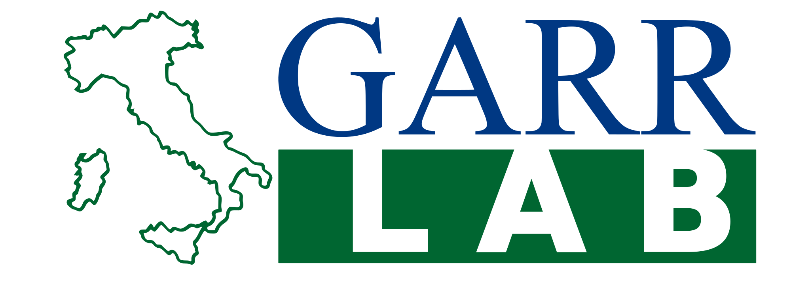

+++
title = "Project: GARRistini"
+++

== Local referents



	{{
		.Scratch.Set "memberListFilter_byName" ( slice
			"Giuseppe Masino"
			"Francesco Di Nucci"
			"Luca Topo"
		)
	}}
	{{ .Scratch.Set "memberCardFilter_byAttr" ( slice "contacts" ) }}
	
	{{ partial "memberCardList.html" . }}



== Links

https://garristini.garrlab.it[OFFICIAL WEBSITE]

== Details

GARRistini is an initiatiative in collaboration with
link:https://www.garrlab.it[GARRLab],
born with the intention to form an informal community made up by an increasing
number of technician and academic students exploiting the resources of
link:https://garr.it[GARR: the Italian NREN].

We have a very simple mandate: +
leveraging the bleeding-edge infrastructures provided by GARR to foster our
knowledge in a wide range of ICT technologies like:
Networking, Infrastructure management, GitOps, Security, …and lots of other 
things.

The community welcomes any academic student, with any level of expertise,
who is interested in the covered topics. +
For info on how to join visit the official website or contact a referent.